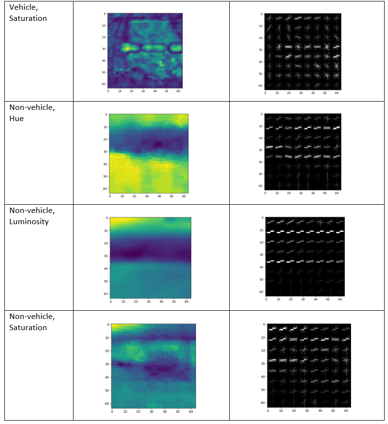
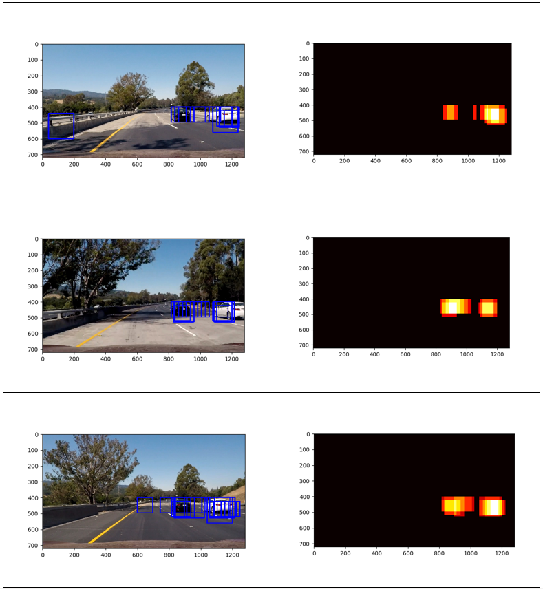

# Vehicle Detection

Overview
---
In this project I created a software pipeline to detect vehicles in a video feed. This was accomplished with the following steps:  
* Perform a Histogram of Oriented Gradients (HOG) feature extraction on a labeled training set of images and train a classifier Linear SVM classifier
* Apply a color transform and append binned color features, as well as histograms of color, to the HOG feature vector. 
* Implement a sliding-window technique and use the trained classifier to search for vehicles in images.
* Run your pipeline on a video stream and create a heat map of recurring detections frame by frame to reject outliers and follow detected vehicles.
* Estimate a bounding box for vehicles detected.

Implementation
---

### Histogram of Oriented Gradients
##### 1. Using HOG features
A histogram of oriented gradients was used, along with spatial binning and color histograms, to extract features from the vehicle and non-vehicle training images and later from the images to be classified. A separate module named vehicle_classifier_generator.py is used to generate, save, and load the classifier based on the training set, and the HOG feature extraction function itself belongs to yet another module named feature_extaction_functions.py. The HOG feature extraction function is used as follows:
pipeline.py  

* Line 13 > Open saved classifier. If no saved classifier present, generate a new one using vehicle_classifier_geneator.py
vehicle_classifier_generator.py  
* Lines 38, 44 > Extract features from vehicle image training set and non-vehicle image training set
feature_extraction_functions.py  
* Lines 89-102 > Extract HOG features from input image  
* 
Different color spaces and HOG parameters, such as number of orientations, were explored to see which configuration produced HOG features that seemed to make a distinction between vehicle and non-vehicle images. Below are some examples showing the HOG features extracted from the separate channels when image is converted to HLS color space. It’s clear that some channels are more visibly effective at extracting vehicle features from the HOG images, but the HLS color space seemed to be most effective compared to other color spaces.




##### 2. Choosing HOG parameters
The HOG parameters were chosen by first decreasing the amount of features extracted used in the project lesson and then generating and testing an SVM classifier. To reach a high enough accuracy (> 99%), more HOG features were added (e.g. the number of orientations were increased) until I arrived at the following values:

```
orient = 9	
pix_per_cell = 8 
cell_per_block = 2 
hog_channel = 'ALL' 
```

##### 3. Generating the classifier

In addition to a histogram of oriented gradients, spatial binning and color histograms were used to extract features from the images in the dataset. The SVM classifier used is generated on line 14 of the `vehicle_classifier_generator.py` file in the `generate_svc_and_params` function. First, the vehicle and non-vehicle image files are collected, and a sample of these image files is set to be used for generating the SVM. Next, the vehicle and non-vehicle features are extracted on lines 38 and 44 respectively, using the `extract_feature`s function.  

As an aside, the `extract_feature`s function is found in the `feature_extraction_functions.py` module and it contains methods for HOG feature extraction and spatial binning and color histogram feature extraction. The spatial binning feature extraction method is found on line 41, and the color histogram feature extraction method is found on line 47. Finally, the extract_features method on line 47 combines all three feature types to form the final feature vector.  

With the final feature vectors generated for all data points, a scaler is then used to normalize the feature set for all the examples. The normalized data set is then split into a training and test set on line 67 of the `vehicle_classifier_generator.py` module, and these sets are used to train the SVM and evaluate its accuracy between lines 74 and 88.  

The program output shows some info relating to the training dataset and the classifier accuracy:  
```
8792 samples used
126.28 Seconds to extract HOG features...
Using: 9 orientations 8 pixels per cell and 2 cells per block
Feature vector length: 8460
43.54 Seconds to train SVC...
Test Accuracy of SVC =  0.9966
```

The overall effectiveness was qualitatively evaluated using the sliding window method described in the next section. 

Sliding Window Search
---
##### 1. Implementation

To identify vehicles in the input image, I used a multi-scaled window search and restricted the search region to be below the horizon. The function for the window search itself, called find_cars, is found in module pipeline.py on line 24. This function takes in a start and stop value for the y-coordinate over which the search will be done, the scale for the search box (the scale is in multiples of the original image size used when generating the classifier), and the HOG, spatial binning, and color histogram parameters used to classify the training images. All these parameters are used to search the entire input image using windows with a size specified by the scale, and then uses the SVM to classify each sample image as vehicle or not-vehicle.

##### 2. Choosing the search parameters

The multi-scaled sliding window search function find_cars is utilized in the process_image function starting on line 167 of the pipeline.py module. I decided on the scales and search regions used by running the pipeline on the set of test images and seeing which configurations reliably identified the vehicles in the images with minimal false positives. I found that using a scale above 2.5 produced too many false positives, and I noticed that there were no vehicles on the scale of the window size used (64x64 pixels). As a result, I settled on using scales of 1.5, 2.0, and 2.5. I used a 75% overlap for each successive search window.  

In addition to using different scales, I also defined different search regions for each scale. As vehicles become smaller as they move to the horizon, I only allowed the 1.5 scale search to run closer to the horizon, and for each larger scale I allowed it to run closer away from the horizon, i.e. closer to the bottom of the image. I noticed that this reduced the amount of false positives and increased reliability in spotting the vehicles in the test images. I also experimented with the window overlap and found that 75% was more effective than 50% when it came to identifying vehicles in the image. I was surprised at how effective the combination of search scales and overlap percentage were. When a single search scale was used, e.g. 1.5 with a 50% overlap was used, the window search would sometimes completely miss vehicles in the frame. But when these parameters were slightly tweaked to 1.5 scale and 75%, all vehicles were at least identified once in all test images.  

Below are the positive window search boxes drawn on the test images. There are false positives in half of the frames, but at least all vehicles are identified at least once in all images.  
  

Video Implementation
---

##### 1. Final result

The final video output is in the annotated_final.mp4 video file. 

##### 2. False positive rejection

A heatmap for overlapping positive search boxes was used to filter in confident vehicle identifications and filter out weak ones. The threshold was set to 1, so only pixels that are found in at least two boxes are used for the final bounding box. Once the hot pixels are identified, the final bounding boxes are generated using the label function found in the scipy.ndimage.measurements module. This heatmapping process is found in the pipeline.py module on lines 193 to 195. The results can be seen below:


  

It’s clear in the results that there is a trade-off. In the 3rd image, the vehicle is filtered out because it is only classified as a vehicle in a single window, and in the 2nd image, a false positive is filtered in because it satisfied the heatmap threshold. Using the heatmap method, there are still some false positives that make it in and some true positives that get filtered out, but it’s clear that the vehicles are successfully marked in most frames and most false positives are filtered out. An example of the final bounding box from the heatmap can be seen below:


##### 3. Successive frame filtering

In addition to the heatmap filtering used on the window search results explained above, a heatmap of the hot pixels from successive frames’ heatmaps was further used to generate the final bounding boxes. This process can be found between lines 196-203. A threshold is applied to current heatmap, and then the hot pixels are clipped at a value of 1. The current heatmap is then added to a global list of the ten previous heatmaps. The threshold is then applied to the sum of the heatmaps from the previous ten frames, and only the pixels with a value of 6 or greater (i.e. found in 6 of the last 10 frames) are added to the final heatmap. The final heatmap is used to generate the final bounding boxes with the aim of reducing false positives and only filtering in vehicles that are detected in multiple successive frames.  

Discussion
---
##### Limitations and future improvements

The pipeline seems to naturally result in a sizable amount of false positives. Once I saw that it was reliably capturing the vehicles in each test image and not returning only a limited amount of false positives, I decided to implement the kind of false positive filtering explained just above. As a future improvement, I’d like to implement some kind of object position tracking. Once a vehicle is detected with confidence, it’s position (which I imagine would be the center of the bounding box) would be kept in a dynamic list of vehicle positions. Each new frame would find new vehicles, and then these vehicles’ positions would be cross-checked against the known list of vehicle positions from the previous frames. If a vehicle ‘disappears’ from frame to frame because of changes in lighting, sun glare, etc., then at least it’s last known position will still be known to the pipeline. The last known position could be used to overlay a bounding box even when the vehicle is temporarily invisible, or it could be used to quickly give confidence to a ‘new’ vehicle detection if that new vehicle is located in the same position as a vehicle that become ‘invisible’.

Additionally, my pipeline visibly fails in the test video as it gives false positives when the color of the road changes from black to gray. Theoretically I could use negative hard mining to inject more images like this into the training image set, that way the change in color from black to gray is not identified as a vehicle. 
